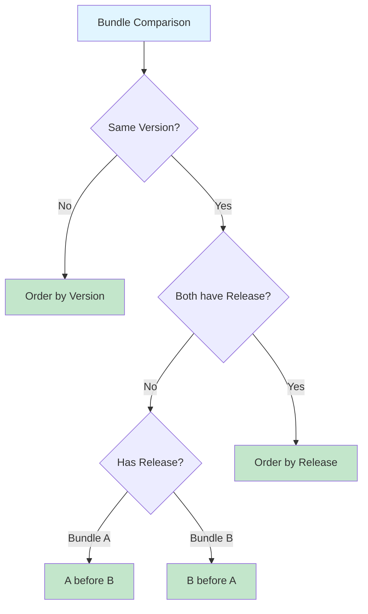

A ClusterServiceVersion (CSV) represents a particular version of a running operator on a cluster. It includes metadata such as name, description, version, repository link, labels, icon, etc. It declares `owned`/`required` CRDs, cluster requirements, and install strategy that tells OLM how to create required resources and set up the operator as a [deployment](https://kubernetes.io/docs/concepts/workloads/controllers/deployment/).

OLM requires you to provide metadata about your operator in order to ensure that it can be kept running safely on a cluster, and to provide information about how updates should be applied as you publish new versions of your operator.

This is very similar to packaging software for a traditional operating system - think of the packaging step for OLM as the stage at which you make your `rpm`, `deb`, or `apk` bundle.

## Writing your Operator Manifests

OLM uses an api called `ClusterServiceVersion` (CSV) to describe a single instance of a version of an operator. This is the main entrypoint for packaging an operator for OLM.

There are two important ways to think about the CSV:

1. Like an `rpm` or `deb`, it collects metadata about the operator that is required to install it onto the cluster.
2. Like a `Deployment` that can stamp out `Pod`s from a template, the `ClusterServiceVersion` describes a template for the operator `Deployment` and can stamp them out.

This is all in service of ensuring that when a user installs an operator from OLM, they can understand what changes are happening to the cluster, and OLM can ensure that installing the operator is a safe operation.

## Example ClusterServiceVersion

```yaml
apiVersion: operators.coreos.com/v1alpha1
kind: ClusterServiceVersion
metadata:
  annotations:
  name: memcached-operator.v0.10.0
spec:
  # metadata
  description: This is an operator for memcached.
  displayName: Memcached Operator
  keywords:
  - memcached
  - app
  maintainers:
  - email: corp@example.com
    name: Some Corp
  maturity: alpha
  provider:
    name: Example
    url: www.example.com
  version: 0.10.0
  minKubeVersion: 1.16.0

  # operator scope
  installModes:
  - supported: true
    type: OwnNamespace
  - supported: true
    type: SingleNamespace
  - supported: false
    type: MultiNamespace
  - supported: true
    type: AllNamespaces

  # installation
  install:
    # strategy indicates what type of deployment artifacts are used
    strategy: deployment
    # spec for the deployment strategy is a list of deployment specs and required permissions - similar to a pod template used in a deployment
    spec:
      permissions:
      - serviceAccountName: memcached-operator
        rules:
        - apiGroups:
          - ""
          resources:
          - pods
          verbs:
          - '*'
          # the rest of the rules
      # permissions required at the cluster scope
      clusterPermissions:
      - serviceAccountName: memcached-operator
        rules:
        - apiGroups:
          - ""
          resources:
          - serviceaccounts
          verbs:
          - '*'
          # the rest of the rules
      deployments:
      - name: memcached-operator
        spec:
          replicas: 1
          # the rest of a deployment spec

  # apis provided by the operator
  customresourcedefinitions:
    owned:
    # a list of CRDs that this operator owns
    # name is the metadata.name of the CRD (which is of the form <plural>.<group>)
    - name: memcacheds.cache.example.com
      # version is the spec.versions[].name value defined in the CRD
      version: v1alpha1
      # kind is the CamelCased singular value defined in spec.names.kind of the CRD.
      kind: Memcached
    required:
    # a list of CRDs that this operator requires
    # see field descriptions above
    - name: others.example.com
      version: v1alpha1
      kind: Other
```
## Release Field

The `release` field is an optional field in the CSV spec that specifies the packaging version of an operator. It allows operator authors to distinguish between different builds of the same operator version.

### When to Use the Release Field

Use the `release` field when you need to make changes to the CSV that don't affect the operator's functionality, such as:

- Fixing typos in descriptions
- Adding or amending annotations or labels
- Amending examples or documentation
- Producing different builds for different environments

### Format and Validation

The `release` field must satisfy the following criteria:
- Composed of dot-separated identifiers containing only alphanumerics and hyphens
- Maximum length of 20 characters
- **Cannot contain build metadata** (the `+` character and everything after it)

Examples: `1`, `alpha`, `alpha.1`, `beta-1`, `rc.2.0`

### Example

```yaml
apiVersion: operators.coreos.com/v1alpha1
kind: ClusterServiceVersion
metadata:
  name: memcached-operator-v0.10.0-1
spec:
  version: 0.10.0
  release: "1"  # Optional packaging version
  displayName: Memcached Operator
  description: This is an operator for memcached.
  # ... rest of CSV spec
```

### Bundle Naming Convention with Release

When a `release` field is specified, the bundle name must follow the convention:

```
<package-name>-v<version>-<release>
```

**Examples:**
- `memcached-operator-v0.10.0-1`
- `memcached-operator-v0.10.0-alpha.1`
- `memcached-operator-v0.10.0-rc.2`

### Version Ordering

Bundles are ordered using a composite version that considers both `version` and `release`:

1. Bundles are first ordered by semantic version
2. For bundles with the same version, those **with** a release are ordered **before** those **without** a release
3. Bundles with the same version and both having releases are ordered from highest to lowest release version



**Example versions in ascending order:**
```
memcached-operator.v0.9.0          # version 0.9.0, no release
memcached-operator.v0.10.0         # version 0.10.0, no release
memcached-operator-v0.10.0-1       # version 0.10.0, release "1"
memcached-operator-v0.10.0-2       # version 0.10.0, release "2"
memcached-operator-v0.10.0-alpha   # version 0.10.0, release "alpha"
```

### Build Metadata Restriction

The `release` field **cannot contain build metadata**. The following is **invalid**:

```yaml
# ❌ INVALID - release cannot contain build metadata (the + character)
version: 0.10.0
release: "1+fffdb0e"
```

```yaml
# ✅ VALID - build metadata can be in version when no release is present
version: 0.10.0+fffdb0e
# no release field
```