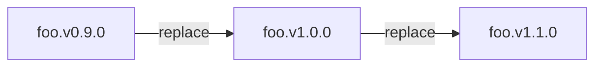
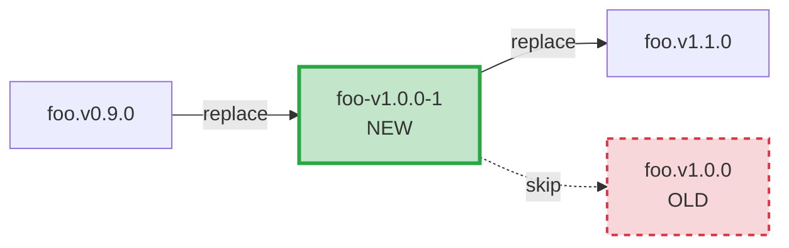
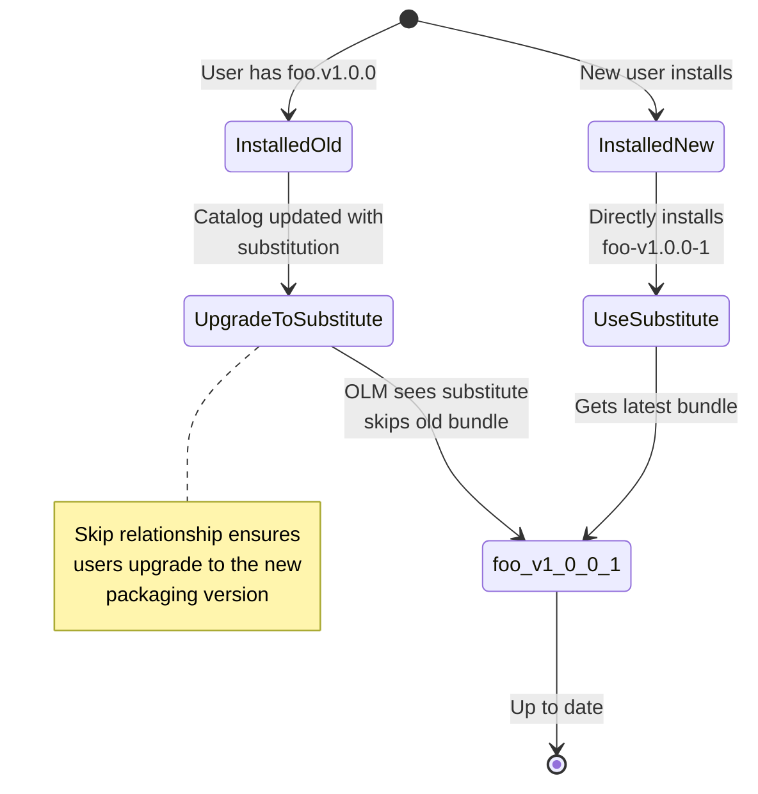

>Note: `catalog templates` are **ALPHA** functionality and may adopt breaking changes


## Concept and Design

File-Based Catalogs (FBC) are a major improvement to the imperative update graph approaches of previous versions. FBCs give operator authors a [declarative and deterministic approach to defining their update graph](https://olm.operatorframework.io/docs/concepts/olm-architecture/operator-catalog/creating-an-update-graph/). However, FBCs can get complex, especially as the number of releases and dependencies scale. We introduce the concept of a `catalog template` (referred to as `template` going forward) as an approach to simplifying interacting with FBCs.

In this context, there are two components to every `template`:
1. An arbitrary API
2. An executable which processes #1 and produces a valid FBC.

The templates supported by [`opm`](https://github.com/operator-framework/operator-registry/blob/master/docs/design/opm-tooling.md) are:
- the [`basic template`](#basic-template), which provides a simplified abstraction of an FBC
- the [`semver template`](#semver-template), which provides the capability to generate an entire upgrade graph

## Basic Template
The `basic template` is an input schema which eliminates FBC information that can be retrieved from existing registries when we process it.
Within the schema, users can add entries composed of any valid [FBC schema](https://olm.operatorframework.io/docs/reference/file-based-catalogs/#olm-defined-schemas) components, but supply only the bundle image reference for any `olm.bundle` objects. This results in a greatly simplified, smaller document.
This approach may be attractive to operator authors who maintain existing catalogs and just want to simplify the format, or for operator authors who need to retain an update graph which cannot be based on `semver`.

### Usage

```sh
opm alpha render-template basic [flags] <filename>
```


| Flag                | Description                                                                            |
| ------------------- | -------------------------------------------------------------------------------------- |
| -h, --help          | prints help/usage information                                                          |
| -o, --output <type> | the output format, can be `yaml` or `json`                                             |
| --skip-tls-verify   | skip TLS certificate verification for container image registries while pulling bundles |
| --use-http          | use plain HTTP for container image registries while pulling bundles                    |

`--skip-tls-verify` and `--use-http` are mutually exclusive flags.

### Example

In a very simple example, we define an `olm.package` and an `olm.channel` composed of two `olm.bundle` objects that have an image name attribute but no other attributes/properties.
```yaml
schema: olm.template.basic
entries:
  - schema: olm.package
    name: example-operator
    defaultChannel: stable
  - schema: olm.channel
    package: example-operator
    name: stable
    entries:
      - name: example-operator.v0.1.0
      - name: example-operator.v0.2.0
        replaces: example-operator.v0.1.0
  - schema: olm.bundle
    image: docker.io/example/example-operator-bundle:0.1.0
  - schema: olm.bundle
    image: docker.io/example/example-operator-bundle:0.2.0
```


Using the `opm alpha render-template basic` command on this input generates the full FBC (skipping large bundle metadata objects):

```yaml
---
defaultChannel: stable
name: example-operator
schema: olm.package
---
entries:
- name: example-operator.v0.1.0
- name: example-operator.v0.2.0
  replaces: example-operator.v0.1.0
name: stable
package: example-operator
schema: olm.channel
---
image: docker.io/example/example-operator-bundle:0.1.0
name: example-operator.v0.1.0
package: example-operator
properties:
- type: olm.gvk
  value:
    group: example.com
    kind: App
    version: v1
- type: olm.package
  value:
    packageName: example-operator
    version: 0.1.0
relatedImages:
- image: docker.io/example/example-operator-bundle:0.1.0
  name: ""
- image: docker.io/example/example-operator:0.1.0
  name: ""
schema: olm.bundle
---
image: docker.io/example/example-operator-bundle:0.2.0
name: example-operator.v0.2.0
package: example-operator
properties:
- type: olm.gvk
  value:
    group: example.com
    kind: App
    version: v1
- type: olm.package
  value:
    packageName: example-operator
    version: 0.2.0
relatedImages:
- image: docker.io/example/example-operator-bundle:0.2.0
  name: ""
- image: docker.io/example/example-operator:0.2.0
  name: ""
schema: olm.bundle
```

## Converting from FBC to Basic Template
The `opm` tool provides the capability to render existing File-Based Catalogs to basic catalog templates in JSON or YAML formats.

### Usage

```sh
opm alpha convert-template basic [flags] <filename>
```

| Flag                | Description                                                                            |
| ------------------- | -------------------------------------------------------------------------------------- |
| -h, --help          | prints help/usage information                                                          |
| -o, --output <type> | the output format, can be `yaml` or `json`                                             |
| --skip-tls-verify   | skip TLS certificate verification for container image registries while pulling bundles |
| --use-http          | use plain HTTP for container image registries while pulling bundles                    |

`--skip-tls-verify` and `--use-http` are mutually exclusive flags.


### Example template in JSON format after the conversion

```json
{
  "schema": "olm.template.basic",
  "entries": [
    {
      "schema": "olm.package",
      "name": "hello-kubernetes",
      "defaultChannel": "alpha",
      "description": "hello-kubernetes"
    },
    {
      "schema": "olm.channel",
      "name": "alpha",
      "package": "hello-kubernetes",
      "entries": [
        {
          "name": "hello-kubernetes.v0.0.1"
        }
      ]
    },
    {
      "schema": "olm.bundle",
      "image": "docker.io/test/hello-kubernetes-operator-bundle:v0.0.1"
    }
  ]
}
```

## Using existing FBC to bootstrap a Substitutes Template
The `opm` tool provides the capability to generate a substitutes template from existing FBC in JSON or YAML formats.

### Usage

```sh
./bin/opm alpha convert-template substitutes [flags] <fbc-location>
```

| Flag                | Description                                                                            |
| ------------------- | -------------------------------------------------------------------------------------- |
| -h, --help          | prints help/usage information                                                          |
| -o, --output <type> | the output format, can be `yaml` or `json`                                             |
| --skip-tls-verify   | skip TLS certificate verification for container image registries while pulling bundles |
| --use-http          | use plain HTTP for container image registries while pulling bundles                    |

`--skip-tls-verify` and `--use-http` are mutually exclusive flags.

### Example template in JSON format after the conversion
>Note: empty substitutions are provided, but must be filled in to be valid

```json
{
  "schema": "olm.template.substitutes",
  "entries": [
    {
      "schema": "olm.package",
      "name": "hello-kubernetes",
      "defaultChannel": "alpha",
      "description": "hello-kubernetes"
    },
    {
      "schema": "olm.channel",
      "name": "alpha",
      "package": "hello-kubernetes",
      "entries": [
        {
          "name": "hello-kubernetes.v0.0.1"
        }
      ]
    },
    {
      "schema": "olm.bundle",
      "image": "docker.io/test/hello-kubernetes-operator-bundle:v0.0.1"
    }
  ],
  "substitutions": [
    {
      "name": "",
      "base": ""
    }
  ]
}
```

## Semver Template

Since a `catalog template` is identified as an input schema which is processed to generate a valid FBC, we can define a `semver template` as a schema which uses channel conventions to facilitate the auto-generation of channels adhering to [Semantic Versioning](https://semver.org/) (semver) guidelines and consistent with best practices on [channel naming](/docs/best-practices/channel-naming/#naming). This approach may be attractive to operator authors who are defining a new upgrade graph, or are already close enough to this template's conventions to be able to adopt it.

>**DISCLAIMER:** since version build metadata MUST be ignored when determining version precedence (see [spec #10](https://semver.org/)) when using semver, if any bundles differ only by build metadata the render attempt will generate a fatal error.

This alpha version of the `semver template` has the following goals:
- terse grammar to minimize creation/maintenance effort
- idempotent output
- simple channel promotion
- demonstration of a common type of channel maturity model
- minor-version (Y-stream) and major-version (X-stream) versioning capabilities
- clear mapping between input schema and output FBC attributes

>**Note:** The semver template depends on the optional `csv.spec.version` field. If you want to use the semver catalog template, you must specify a version in your extension's CSV.

### Specification
Like best practices [recommended channel naming](/docs/best-practices/channel-naming/#recommended-channel-naming), this template supports channel names `Candidate`, `Fast`, and `Stable`, in order of increasing channel stability. We leverage this relationship when calculating the default channel for the package. 

`GenerateMajorChannels` and `GenerateMinorChannels` dictate whether this template will generate X-stream or Y-stream channels (attributes can be set independently). If omitted, only minor (Y-stream) channels will be generated. 

Under each channel are a list of bundle image references which contribute to that channel. At least one channel must have bundle images.

The `olm.semver` [cue](https://cuelang.org/docs/references/spec/) schema is:

```cue
#Package: {
  schema: "olm.semver"

  // optional flag to control generating minor-version channels, defaults to _true_ if unspecified
  GenerateMinorChannels?: bool

  // optional flag to control generating major-version channels, defaults to _false_ if unspecified
  GenerateMajorChannels?: bool

  // optional preference for major- or minor-version channels, when both are generated and identical in stability and version
  DefaultChannelTypePreference?: string

  // optional candidate channel
  Candidate?: {
    Bundles: [...#ImageEntry]
  }

  // optional fast channel
  Fast?: {
    Bundles: [...#ImageEntry]
  }

  // optional stable channel
  Stable?: {
    Bundles: [...#ImageEntry]
  }

  #ImageEntry: {
    Image: string
  }
}
```

### Usage

```sh
opm alpha render-template semver [flags] <filename>
```


| Flag                | Description                                                                            |
| ------------------- | -------------------------------------------------------------------------------------- |
| -h, --help          | prints help/usage information                                                          |
| -o, --output <type> | the output format, can be `yaml` or `json`                                             |
| --skip-tls-verify   | skip TLS certificate verification for container image registries while pulling bundles |
| --use-http          | use plain HTTP for container image registries while pulling bundles                    |

`--skip-tls-verify` and `--use-http` are mutually exclusive flags.

### Examples 

With the following (hypothetical) example we define a mock bundle which has 11 versions, represented across each of the channel types:

```yaml
Schema: olm.semver
GenerateMajorChannels: true
GenerateMinorChannels: true
Candidate:
  Bundles:
  - Image: quay.io/foo/olm:testoperator.v0.1.0
  - Image: quay.io/foo/olm:testoperator.v0.1.1
  - Image: quay.io/foo/olm:testoperator.v0.1.2
  - Image: quay.io/foo/olm:testoperator.v0.1.3
  - Image: quay.io/foo/olm:testoperator.v0.2.0
  - Image: quay.io/foo/olm:testoperator.v0.2.1
  - Image: quay.io/foo/olm:testoperator.v0.2.2
  - Image: quay.io/foo/olm:testoperator.v0.3.0
  - Image: quay.io/foo/olm:testoperator.v1.0.0
  - Image: quay.io/foo/olm:testoperator.v1.0.1
  - Image: quay.io/foo/olm:testoperator.v1.1.0
Fast:
  Bundles:
  - Image: quay.io/foo/olm:testoperator.v0.2.1
  - Image: quay.io/foo/olm:testoperator.v0.2.2
  - Image: quay.io/foo/olm:testoperator.v0.3.0
  - Image: quay.io/foo/olm:testoperator.v1.0.1
  - Image: quay.io/foo/olm:testoperator.v1.1.0
Stable:
  Bundles:
  - Image: quay.io/foo/olm:testoperator.v1.0.1
```

In this example, `Candidate` has the entire version range of bundles,  `Fast` has a mix of older and more-recent versions, and `Stable` channel only has a single published entry. 

#### Generating major-version channels

If we set the template attributes 

```yaml 
GenerateMajorChannels: true
GenerateMinorChannels: false
```

we generate the following major channels (filtering out large bundle metadata):
```yaml
---
defaultChannel: stable-v1
name: testoperator
schema: olm.package
---
entries:
- name: testoperator.v0.1.0
- name: testoperator.v0.1.1
- name: testoperator.v0.1.2
- name: testoperator.v0.1.3
  skips:
  - testoperator.v0.1.0
  - testoperator.v0.1.1
  - testoperator.v0.1.2
- name: testoperator.v0.2.0
- name: testoperator.v0.2.1
- name: testoperator.v0.2.2
  replaces: testoperator.v0.1.3
  skips:
  - testoperator.v0.2.0
  - testoperator.v0.2.1
- name: testoperator.v0.3.0
  replaces: testoperator.v0.2.2
name: candidate-v0
package: testoperator
schema: olm.channel
---
entries:
- name: testoperator.v1.0.0
- name: testoperator.v1.0.1
  skips:
  - testoperator.v1.0.0
- name: testoperator.v1.1.0
  replaces: testoperator.v1.0.1
name: candidate-v1
package: testoperator
schema: olm.channel
---
entries:
- name: testoperator.v0.2.1
- name: testoperator.v0.2.2
  skips:
  - testoperator.v0.2.1
- name: testoperator.v0.3.0
  replaces: testoperator.v0.2.2
name: fast-v0
package: testoperator
schema: olm.channel
---
entries:
- name: testoperator.v1.0.1
- name: testoperator.v1.1.0
  replaces: testoperator.v1.0.1
name: fast-v1
package: testoperator
schema: olm.channel
---
entries:
- name: testoperator.v1.0.1
name: stable-v1
package: testoperator
schema: olm.channel
```

We generated a channel for each template channel entity corresponding to each of the 0.\#.\#, 1.\#.\# major version ranges with skips to the head of the highest semver in a channel. We also generated a replaces edge to traverse across minor version transitions within each major channel. Finally, we generated an `olm.package` object, setting as default the most-stable channel head we created. This process will prefer `Stable` channel over `Fast`, over `Candidate` and then a higher bundle version over a lower version.  
(Please note that the naming of the generated channels indicates the digits of significance for that channel. For example, `fast-v1` is a decomposed channel of the `fast` type which contains only major versions of contributing bundles matching `v1`.)  

#### Generating minor-version channels

For contrast, if we set the template attributes

```yaml
GenerateMinorChannels: true
GenerateMajorChannels: false
```

 we generate the following minor channels (again filtering out large bundle metadata):

```yaml
---
defaultChannel: stable-v1.0
name: testoperator
schema: olm.package
---
entries:
  - name: testoperator.v0.1.0
  - name: testoperator.v0.1.1
  - name: testoperator.v0.1.2
  - name: testoperator.v0.1.3
    skips:
      - testoperator.v0.1.0
      - testoperator.v0.1.1
      - testoperator.v0.1.2
name: candidate-v0.1
package: testoperator
schema: olm.channel
---
entries:
  - name: testoperator.v0.2.0
  - name: testoperator.v0.2.1
  - name: testoperator.v0.2.2
    replaces: testoperator.v0.1.3
    skips:
      - testoperator.v0.2.0
      - testoperator.v0.2.1
name: candidate-v0.2
package: testoperator
schema: olm.channel
---
entries:
  - name: testoperator.v0.3.0
    replaces: testoperator.v0.2.2
name: candidate-v0.3
package: testoperator
schema: olm.channel
---
entries:
  - name: testoperator.v1.0.0
  - name: testoperator.v1.0.1
    skips:
      - testoperator.v1.0.0
name: candidate-v1.0
package: testoperator
schema: olm.channel
---
entries:
  - name: testoperator.v1.1.0
    replaces: testoperator.v1.0.1
name: candidate-v1.1
package: testoperator
schema: olm.channel
---
entries:
  - name: testoperator.v0.2.1
  - name: testoperator.v0.2.2
    skips:
      - testoperator.v0.2.1
name: fast-v0.2
package: testoperator
schema: olm.channel
---
entries:
  - name: testoperator.v0.3.0
    replaces: testoperator.v0.2.2
name: fast-v0.3
package: testoperator
schema: olm.channel
---
entries:
  - name: testoperator.v1.0.1
name: fast-v1.0
package: testoperator
schema: olm.channel
---
entries:
  - name: testoperator.v1.1.0
    replaces: testoperator.v1.0.1
name: fast-v1.1
package: testoperator
schema: olm.channel
---
entries:
  - name: testoperator.v1.0.1
name: stable-v1.0
package: testoperator
schema: olm.channel

```

Here, a channel is generated for each template channel which differs by minor version, and each channel has a `replaces` edge from the predecessor channel to the next-lesser minor bundle version. Please note that at no time do we transgress across major-version boundaries with the channels, to be consistent with [the semver convention](https://semver.org/) for major versions, where the purpose is to make incompatible API changes.

#### Generating both channel types, and disambiguating default channel selection

In the case that we generate both major-version and minor-version channels:

```yaml
GenerateMinorChannels: true
GenerateMajorChannels: true
```

we can easily end up in a situation where our results yield indifferentiable results, for e.g.:

```yaml
---
entries:
- name: testoperator.v1.0.1
name: stable-v1
package: testoperator
schema: olm.channel
---
entries:
- name: testoperator.v1.0.1
name: stable-v1.0
package: testoperator
schema: olm.channel
```

In this situation, both channels have matching channel archetypes and the channel heads have the same versions.  The `DefaultChannelTypePreference` attribute allows us to deterministically select a single channel in this case.  This attribute defaults to prefer minor-version channels (`DefaultChannelTypePreference: minor`), but can be overridden in the schema if the author wishes to prefer major-version channels instead (`DefaultChannelTypePreference: major`). 

With `DefaultChannelTypePreference` set to `major`, our most-stable channels and package output would look like
```yaml
---
defaultChannel: stable-v1
name: testoperator
schema: olm.package
---
entries:
- name: testoperator.v1.0.1
name: stable-v1
package: testoperator
schema: olm.channel
---
entries:
- name: testoperator.v1.0.1
name: stable-v1.0
package: testoperator
schema: olm.channel
```

## Substitutes Template

The substitutes template provides a safe and structured way to replace bundles in an upgrade graph with newer packaging versions. This is particularly useful when you need to republish a bundle with non-functional changes (documentation fixes, label updates, etc.) and want to ensure users can upgrade to the new bundle.

Before the substitutes template, when you needed to replace a bundle in a catalog (for example, `foo.v1.0.0` with a documentation fix), you had two options:

1. **Manually edit all channel entries** - Error-prone and requires updating multiple references
2. **Use the deprecated `substitutesFor` CSV field** - Not available in file-based catalogs

The `olm.template.substitutes` template solves this by automatically handling the complex graph mutations required to safely replace bundles.

### Schema

```yaml
schema: olm.template.substitutes
entries:
  - # Existing FBC catalog content (packages, channels, bundles)
substitutions:
  - name: <new-bundle-image>  # Bundle image to substitute
    base: <old-bundle-name>   # Bundle name to replace
```

### How It Works

When you define a substitution:

1. The template validates that the substitute bundle has a higher composite version than the base bundle
2. For each channel containing the base bundle, the template:
   - Adds the new bundle to the channel
   - Moves upgrade edges (replaces, skips, skipRange) from the base to the substitute
   - Adds a skip edge from substitute to base
   - Updates all other entries that reference the base to reference the substitute instead

Before Substitution


After Substitution


### Step-by-Step Example

#### Step 1: Initial Catalog State

You have a catalog with three bundles in the `stable` channel:

```yaml
---
schema: olm.channel
package: foo
name: stable
entries:
  - name: foo.v0.9.0
  - name: foo.v1.0.0
    replaces: foo.v0.9.0
  - name: foo.v1.1.0
    replaces: foo.v1.0.0
---
schema: olm.bundle
package: foo
name: foo.v1.0.0
image: quay.io/example/foo-bundle:v1.0.0
properties:
  - type: olm.package
    value:
      packageName: foo
      version: 1.0.0
```

#### Step 2: Create New Bundle with Release

You discover `foo.v1.0.0` is missing a critical annotation. 
You: 
1. update the bundle's annotation in `metadata/annotations.yaml`
2. update the bundle's CSV with `spec.release` set (here set to 1)
3. ensure that the bundle's `metadata-name` follows the format required for using release versions
4. publish the bundle

The rendered bundle image (via `opm render`) would look something like this in FBC:

```yaml
---
schema: olm.bundle
package: foo
name: foo-v1.0.0-1  # New name with release
image: quay.io/example/foo-bundle:v1.0.0-1
properties:
  - type: olm.package
    value:
      packageName: foo
      version: 1.0.0
      release: "1"  # Added release
```

#### Step 3: Create Substitutes Template
Instead of manually updating the catalog, create a substitutes template:
> Note: see [Using existing FBC to bootstrap a Substitutes Template](#using-existing-fbc-to-bootstrap-a-substitutes-template) to get `opm` to generate this for you.

```yaml
schema: olm.template.substitutes
entries:
  # Include all your existing catalog content here
  # (packages, channels, bundles - except the new foo-v1.0.0-1)
substitutions:
  - name: quay.io/example/foo-bundle:v1.0.0-1  # New bundle image
    base: foo.v1.0.0  # Old bundle name to replace
```

#### Step 4: Render the Template

Use `opm` to render the template:

```bash
opm alpha render-template substitutes-template.yaml -o yaml > catalog/foo/index.yaml
```

The rendered catalog will have:

```yaml
---
schema: olm.channel
package: foo
name: stable
entries:
  - name: foo.v0.9.0
  - name: foo-v1.0.0-1  # NEW substitute bundle
    replaces: foo.v0.9.0
    skips:
      - foo.v1.0.0  # Skips the old bundle
  - name: foo.v1.1.0
    replaces: foo-v1.0.0-1  # Updated to point to new bundle
  - name: foo.v1.0.0  # OLD bundle remains in catalog
    # No upgrade edges (orphaned)
```

### Substitution Rules and Validation

The template enforces several validation rules:

1. **Composite version check**: The substitute bundle must have a higher composite version than the base bundle
   ```yaml
   # ✅ VALID - release "1" > no release
   base: foo.v1.0.0 (version 1.0.0, no release)
   name: foo-v1.0.0-1 (version 1.0.0, release "1")

   # ❌ INVALID - same version and release
   base: foo-v1.0.0-1
   name: foo-v1.0.0-1

   # ❌ INVALID - lower composite version
   base: foo-v1.0.0-2
   name: foo-v1.0.0-1
   ```

2. **Base bundle must exist**: The base bundle name must be present in the catalog

3. **Required fields**: Both `name` (bundle image) and `base` (bundle name) are required

4. **Name vs Base validation**: The `name` and `base` cannot be the same

#### Multiple Substitutions

You can define multiple substitutions in a single template:

```yaml
schema: olm.template.substitutes
entries:
  # ... catalog content ...
substitutions:
  - name: quay.io/example/foo-bundle:v1.0.0-1
    base: foo.v1.0.0
  - name: quay.io/example/foo-bundle:v1.1.0-1
    base: foo.v1.1.0
  - name: quay.io/example/bar-bundle:v2.0.0-alpha.2
    base: bar-v2.0.0-alpha.1
```

The substitutions are processed in order, and each substitution validates against the current state of the catalog.

#### Upgrade Path Diagram



### Best Practices

1. **Use for packaging changes only**: The substitute bundle should be functionally equivalent to the base bundle

2. **Validate composite versions**: Ensure your substitute bundle has a higher composite version (typically by adding a release field)

3. **Test before deploying**: Use `opm validate` to verify the rendered catalog:
   ```bash
   opm alpha render-template template.yaml | opm validate -
   ```

4. **Keep base bundles**: The old bundle remains in the catalog but becomes unreachable through normal upgrade paths (it's still accessible for historical reference)

5. **Document substitutions**: Add comments in your template explaining why each substitution was made

   ```yaml
   substitutions:
     # Fixed typo in operator description
     - name: quay.io/example/foo-bundle:v1.0.0-1
       base: foo.v1.0.0
   ```

### Complete Working Example

```yaml
---
schema: olm.template.substitutes

# Your existing catalog content
entries:
  - schema: olm.package
    name: foo
    defaultChannel: stable

  - schema: olm.channel
    package: foo
    name: stable
    entries:
      - name: foo.v0.9.0
      - name: foo.v1.0.0
        replaces: foo.v0.9.0
      - name: foo.v1.1.0
        replaces: foo.v1.0.0

  - schema: olm.bundle
    package: foo
    name: foo.v0.9.0
    image: quay.io/example/foo-bundle:v0.9.0
    properties:
      - type: olm.package
        value:
          packageName: foo
          version: 0.9.0

  - schema: olm.bundle
    package: foo
    name: foo.v1.0.0
    image: quay.io/example/foo-bundle:v1.0.0
    properties:
      - type: olm.package
        value:
          packageName: foo
          version: 1.0.0

  - schema: olm.bundle
    package: foo
    name: foo.v1.1.0
    image: quay.io/example/foo-bundle:v1.1.0
    properties:
      - type: olm.package
        value:
          packageName: foo
          version: 1.1.0

# Define the substitution
substitutions:
  - name: quay.io/example/foo-bundle:v1.0.0-1  # New bundle with fixed docs
    base: foo.v1.0.0  # Old bundle to replace
```

Render with:
```bash
opm alpha render-template substitutes-template.yaml -o yaml > catalog/foo/index.yaml
```
